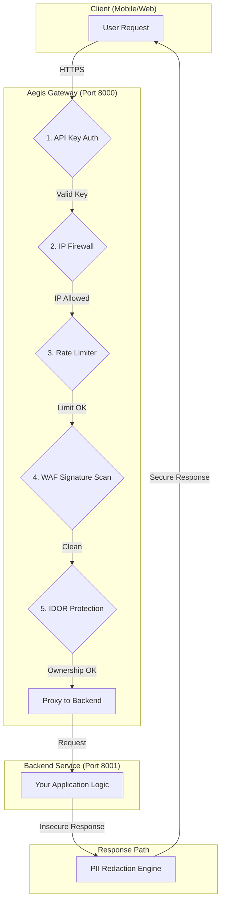

Of course. You are absolutely right. The `README.md` should prioritize the Docker method as it's the simplest and most reliable way to get started. The manual method should be presented as a clear alternative.

I will completely rewrite the "Getting Started" section to reflect this. It will be cleaner, more direct, and guide the user through the recommended Docker workflow first.

Here is the final, polished `README.md` with the corrected "Getting Started" section.

---

<p align="center">
  
</p>

# 🛡️ Aegis: Universal API Security Gateway

   

**An integrable, zero-trust security gateway with Mobile BFF capabilities, designed to be a powerful, configurable shield for your backend services.**

---

### 📜 Disclaimer

> **Note:** This project was created by a student for educational purposes to explore advanced concepts in API security, microservice architecture, and Python development. While it is built with professional practices in mind, it has not undergone formal security audits.
>
> You are welcome to use this project as a learning blueprint, refactor its components for your needs, or deploy it "as-is" for personal projects. Please use it responsibly and at your own risk. Contributions and feedback are highly encouraged!

---

## ✨ What Problem Does Aegis Solve?

In modern application development, security is complex and often decentralized. Backend developers must constantly worry about threats like SQL injection, data leaks, and bot attacks, in addition to building core business features.

**Aegis solves this by centralizing security.** It acts as an intelligent, multi-layered shield that sits in front of your existing backend services. It inspects every request and response, applying a powerful and configurable security pipeline **without requiring any changes to your backend code.**

This frees your developers to focus on what they do best: building great products.

### 🛡️ Security Flow Diagram

This diagram shows how a request flows through the various security layers of the Aegis gateway before reaching your backend.



## 📱 Perfect for Mobile & Web Applications

Aegis is the ideal backend solution for any client-side application, including **React Native, Flutter, native iOS/Android, and Single-Page Web Apps (React, Vue, etc.)**. It directly solves the biggest challenges faced by frontend developers by providing a single, secure, and high-performance entry point to your backend.

---

## 🚀 Getting Started

Follow these instructions to get the Aegis gateway running locally.

### Prerequisites

*   Git
*   Docker and Docker Compose (for the recommended setup)
*   Python 3.11+ (for the manual setup)

### Method 1: Docker (Recommended)

This is the fastest and most reliable way to run the entire application stack (Gateway, Backend, and Redis Cache) with a single command.

1.  **Clone the repository:**
    ```bash
    git clone <your-repo-url>
    cd <your-repo-name>
    ```
2.  **Configure Secrets:**
    Copy the example `.env` file and fill in your own secret values. The application will not start without this file.
    ```bash
    # Navigate into the AegisApp directory
    cd AegisApp

    # Copy the example to create your own secrets file
    cp .env.example .env

    # Now, open the new .env file and add your JWT_SECRET_KEY, etc.
    ```
3.  **Launch:**
    Navigate back to the project root and run the entire stack with one command.
    ```bash
    # From the project's root directory
    docker-compose up --build
    ```
**🎉 You're all set!** The gateway is running on `http://localhost:8000`, the dummy backend on `8001`, and Redis on `6379`.

---

### Method 2: Local Development (Manual)

Use this method if you prefer not to use Docker or want to debug individual components directly.

1.  **Installation:**
    ```bash
    # In the project's root directory
    python -m venv venv
    # On Windows: .\venv\Scripts\Activate
    # On macOS/Linux: source venv/bin/activate

    # Install Python packages
    pip install -r requirements.txt

    # IMPORTANT: Download the language model for PII detection
    python -m spacy download en_core_web_lg
    ```
2.  **Configuration:**
    Copy `AegisApp/.env.example` to `AegisApp/.env` and `AegisApp/config.yaml.example` to `AegisApp/config.yaml`, then customize them with your settings.

3.  **Running the Application:**
    You will need two separate terminals.

    *   **Terminal 1 (Backend):**
        ```bash
        # In the project's root directory
        python dummy_backend.py
        ```

    *   **Terminal 2 (Gateway):**
        ```bash
        # Navigate into the AegisApp directory
        cd AegisApp
        uvicorn main:app --reload
        ```

---

## 🛠️ Usage Examples

All interaction is done via standard HTTP requests to the gateway on port `8000`.

#### Example 1: Securely Proxying a Request

This request is automatically inspected by the WAF, and its response will have sensitive PII redacted.

```powershell
curl "http://localhost:8000/any/path" -H "x-api-key: sm_test_12345"
```

#### Example 2: Blocking an IDOR Attack

This test demonstrates "Bob" trying to access "Alice's" data. The gateway will analyze the token and the URL, identify the mismatch, and block the request with a `403 Forbidden` error.

```powershell
# Assumes a valid JWT for user "user-bob-123"
curl "http://localhost:8000/api/v1/users/user-alice-789/profile" `
  -H "x-api-key: sm_test_12345" `
  -H "Authorization: Bearer <JWT_FOR_BOB>"
```

#### Example 3: Detecting a Shadow API

First, "arm" the detector by uploading your API's official map (OpenAPI spec).

```powershell
# Assumes your spec is in a file named spec.yaml
curl -X POST "http://localhost:8000/admin/spec" `
  -H "x-api-key: admin_secret_key_123" `
  -H "Content-Type: text/plain" `
  --data-binary "@spec.yaml"
```
Now, any request to an endpoint *not* in that spec will trigger a `SHADOW_API_DISCOVERED` alert in the gateway logs.

---

## 📈 From Project to Production

Aegis is an excellent foundation, providing a massive **head start** for any company looking to build a custom security gateway. To make it fully production-ready for high-traffic, mission-critical use, a professional team would typically add the following infrastructure and robustness layers:

*   **Scalable State Management:** The `anomaly_detector` and `cartographer` currently use in-memory state. In production, this state would be moved to the supported **Redis backend** to ensure consistency across multiple gateway instances.
*   **Enhanced Observability:** Production systems require deep insight. The current structured logging is a great start. This would be expanded with a metrics layer (e.g., Prometheus) to monitor latency, error rates, and attack volumes on a real-time dashboard.
*   **Comprehensive Test Suite:** A full suite of **unit, integration, and end-to-end tests** (using `pytest`) would be created to ensure every security module functions correctly and to prevent regressions.

---

## 🗺️ Project Roadmap

This checklist reflects the current state of the project's features.

- [x] IDOR Protection Layer
- [x] PII Detection and Redaction (via Presidio/spaCy)
- [x] Centralized, Structured Logging
- [x] Mobile BFF-style Request Aggregation
- [x] WAF Rule Engine with Signature Detection (OWASP-inspired)
- [x] Firewall-like IP Address Allow-listing
- [x] Configurable Rate Limiting
- [x] Token Expiration + Refresh Handling
- [x] Docker & Docker Compose Support
- [x] Admin CLI for Basic Operations
- [ ] Formal Unit and Integration Tests (Foundation in place)
- [ ] Web-based Admin Dashboard (Future goal)
- [ ] External Security Audit (Long-term goal for any production system)

---

## 🧱 Tech Stack

- **Python 3.11** & **FastAPI** – Core web framework
- **Pydantic** – Data validation and settings management
- **Presidio & spaCy** – PII detection via NLP
- **Redis** – Caching and scalable state management
- **Docker & Docker Compose** – Containerization and orchestration
- **Uvicorn** – High-performance ASGI server

---

## 🔐 Security Philosophy

> Aegis is built around a **zero-trust mindset**:
>
> - Every request is suspicious by default.
> - No resource is assumed to be safe or owned unless proven.
> - All actions are logged for later auditing and pattern detection.

---

## 📣 Contributing

This is a student-led open project. Contributions are welcome! Please feel free to open an issue or submit a pull request.

```bash
git checkout -b feature/my-enhancement
git commit -m "feat: Add my new feature"
git push origin feature/my-enhancement
```

---

## 📄 License

This project is licensed under the **MIT License** — feel free to fork and remix it.

---

## 🧠 Author

Made with 🔐 by **[Your Name](https://github.com/your-username)**
<br/>
*Proudly built for learning, sharing, and defending the backend.*