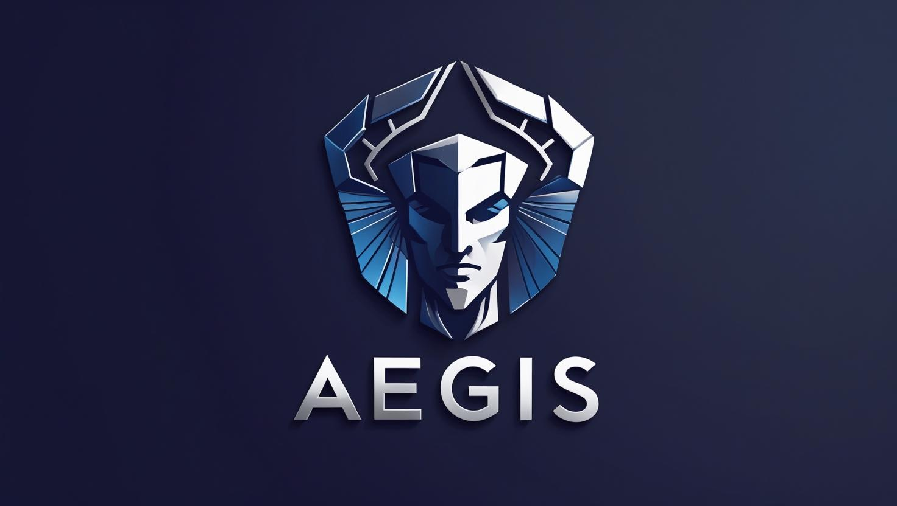

<p align="center">
  
</p>

# 🛡️ Aegis: API Security Gateway

   

**An integrable, zero-trust security gateway and Mobile BFF, designed to be a powerful, configurable shield for your backend services.**

---

### 📜 Disclaimer

> **Note:** This project was created by a student for educational purposes to explore advanced concepts in API security, microservice architecture, and Python development. While it is built with professional practices in mind, it has not undergone formal security audits.
>
> You are welcome to use this project as a learning blueprint, refactor its components for your needs, or deploy it "as-is" for personal projects. Please use it responsibly and at your own risk. Contributions and feedback are highly encouraged!

---

## ✨ What Problem Does Aegis Solve?

In modern application development, security is complex and often decentralized. Backend developers must constantly worry about threats like SQL injection, data leaks, and bot attacks, in addition to building core business features.

**Aegis solves this by centralizing security.** It acts as an intelligent, multi-layered shield that sits in front of your existing backend services. It inspects every request and response, applying a powerful and configurable security pipeline **without requiring any changes to your backend code.**

This frees your developers to focus on what they do best: building great products.

## 🏆 Key Advantages of Aegis

Why choose a solution like Aegis?

*   **🔌 Zero Backend Modification:** Instantly add a robust security layer to any existing API (including legacy systems) without a single line of code change in the target service.
*   **🛡️ Centralized Defense-in-Depth:** Instead of scattering security logic across multiple services, Aegis enforces WAF, threat intelligence, bot detection, and authorization checks in one consistent, manageable place.
*   **🔒 Proactive Data Protection:** The PII (Personally Identifiable Information) redaction engine prevents accidental data leaks, helping you meet compliance standards like GDPR and CCPA by automatically sanitizing responses.
*   **🚀 Accelerated Frontend Performance:** The Mobile BFF (Backend-for-Frontend) capability allows you to aggregate data from multiple microservices into a single, optimized payload, dramatically reducing network calls from your mobile or web app.
*   **🔬 High Configurability:** All security policies—from WAF rules to PII redaction entities—are defined in a simple `config.yaml` file, making it easy for anyone to customize the gateway's behavior without being a security expert.
*   **🏗️ Modular & Integrable:** Built as a reusable `aegis_toolkit`, its security features can be "plugged into" any existing FastAPI application, not just used as a standalone gateway.

---

## 🏛️ Project Architecture

The project is architected as two distinct components to maximize reusability:

1.  **`aegis_toolkit` 🛡️:** A reusable Python library containing all the core security logic. This is the "engine."
2.  **`AegisApp` 🚀:** A runnable FastAPI application that demonstrates how to use the `aegis_toolkit` to build a fully-featured security gateway. This is the "car" built around the engine.

---

## 🚀 Getting Started

Follow these instructions to get the Aegis gateway running locally.

### Prerequisites

*   Python 3.11+
*   `pip` and `virtualenv`

### 1. Installation

```bash
# Clone the repository
git clone <your-repo-url>
cd <your-repo-name>

# Create and activate a virtual environment
python -m venv venv
# On Windows: .\venv\Scripts\Activate
# On macOS/Linux: source venv/bin/activate

# Install the required dependencies from the provided file
pip install -r requirements.txt
```

### 2. Configuration

The application is configured using two files inside the `AegisApp/` directory. Create them from the provided examples.

1.  **`.env` File (Secrets):**
    *   `JWT_SECRET_KEY`: Generate a strong, random secret for signing tokens.
    *   `API_CLIENTS_JSON`: Define the client applications allowed to access the gateway.
    *   `REDIS_URL`: (Optional) Provide a connection string to enable Redis-backed caching and profiling. Leave blank to use the default in-memory cache.

2.  **`config.yaml` File (Rules & Policies):**
    *   `backend_target_url`: The URL of the backend service you want to protect (e.g., `http://localhost:8001`).
    *   `sentry_rules`: Define your WAF rules.
    *   `pii_scan_policy`: Configure which sensitive data to redact for different client roles.
    *   `authorization_policies`: Set up advanced checks like IDOR protection.

### 3. Running the Application

You need to run two services in separate terminals: your backend and the Aegis gateway.

*   **Terminal 1: Start Your Backend Service**
    A simple dummy backend (`dummy_backend.py`) is included for testing.
    ```bash
    python dummy_backend.py
    ```
    This will start a service on `http://localhost:8001`.

*   **Terminal 2: Start the Aegis Gateway**
    Navigate into the `AegisApp` directory to run the main application.
    ```bash
    cd AegisApp
    uvicorn main:app --reload
    ```
    The gateway is now running on `http://localhost:8000`.

**🎉 You're all set!** All requests to `http://localhost:8000` will now be protected by Aegis.

---

## 🛠️ Usage Examples

All interaction is done via standard HTTP requests to the gateway on port `8000`.

#### Example 1: Securely Proxying a Request

This request is automatically inspected by the WAF, and its response will have sensitive PII redacted.

```powershell
curl "http://localhost:8000/any/path" -H "x-api-key: sm_test_12345"
```

#### Example 2: Blocking an IDOR Attack

This test demonstrates "Bob" trying to access "Alice's" data. The gateway will analyze the token and the URL, identify the mismatch, and block the request with a `403 Forbidden` error.

```powershell
# Assumes a valid JWT for user "user-bob-123"
curl "http://localhost:8000/api/v1/users/user-alice-789/profile" `
  -H "x-api-key: sm_test_12345" `
  -H "Authorization: Bearer <JWT_FOR_BOB>"
```

#### Example 3: Detecting a Shadow API

First, "arm" the detector by uploading your API's official map (OpenAPI spec).

```powershell
# Assumes your spec is in a file named spec.yaml
curl -X POST "http://localhost:8000/admin/spec" `
  -H "x-api-key: admin_secret_key_123" `
  -H "Content-Type: text/plain" `
  --data-binary "@spec.yaml"
```

Now, any request to an endpoint *not* in that spec will trigger a `SHADOW_API_DISCOVERED` alert in the gateway logs.

---

## 📈 From Project to Production

Aegis is an excellent foundation, providing a massive **head start** for any company looking to build a custom security gateway. To make it fully production-ready for high-traffic, mission-critical use, a professional team would typically add the following infrastructure and robustness layers:

*   **Scalable State Management:** The `anomaly_detector` and `cartographer` currently use in-memory state, which works for a single process. In production, this state would be moved to the supported **Redis backend** to ensure consistency across multiple gateway instances.

*   **Enhanced Observability:** Production systems require deep insight. The existing `print()` statements would be replaced with **structured logging** (e.g., JSON logs), and a metrics layer (using a tool like Prometheus) would be added to monitor latency, error rates, and attack volumes on a real-time dashboard.

*   **Comprehensive Test Suite:** A full suite of **unit, integration, and end-to-end tests** (using `pytest`) would be created to ensure every security module functions correctly and to prevent regressions when adding new features.

*   **Security Hardening:** The gateway would undergo a formal security review, including **dependency scanning**, **static code analysis**, and the implementation of more advanced, configurable **rate-limiting** policies.

In essence, Aegis provides the sophisticated architectural foundation, and a production deployment involves building the robust operational infrastructure around it.

---

Feel free to explore, experiment, and adapt this project to your needs. Happy coding
